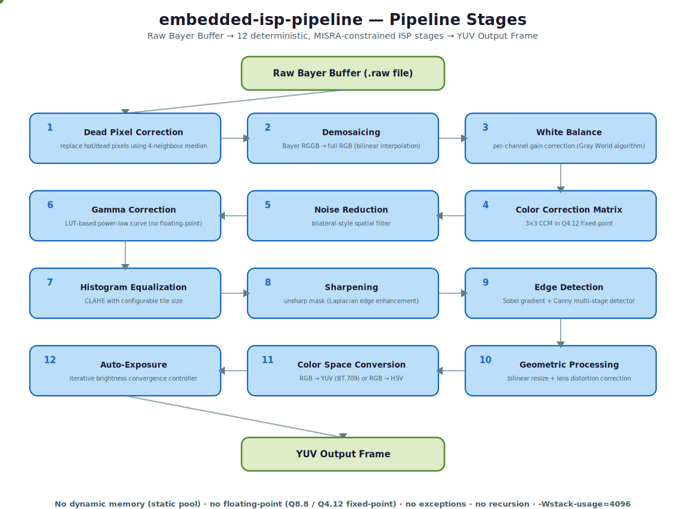

# embedded-isp-pipeline

A Software-in-the-Loop (SIL) Image Signal Processor pipeline written in C++, simulating the camera processing stages that run inside automotive ECUs such as those powered by NXP i.MX8 and S32G.

The pipeline converts raw Bayer sensor data into a fully processed image through a series of deterministic, MISRA C++-constrained stages — no hardware required. Cross-compilation for ARM and emulation via QEMU provide a complete embedded development workflow on a standard laptop.



## Why this project exists

Automotive camera systems run ISP pipelines on resource-constrained ECUs that forbid dynamic memory allocation, floating-point operations, and exceptions. This project implements those same constraints in software, making it possible to develop, validate, and unit-test the pipeline without physical hardware — a methodology called Software-in-the-Loop (SIL), defined in ISO 26262 Part 4.

The codebase is analysed automatically by [embedded-sentinel](https://github.com/UtharaKeerthan/embedded-sentinel), a multi-agent AI system that checks MISRA compliance, classifies ISO 26262 ASIL levels, and generates a requirements traceability matrix.

---

## Pipeline stages

```
Raw Bayer Buffer (.raw file)
         │
         ▼
 1. Dead Pixel Correction     replace hot/dead pixels using 4-neighbour median
         │
         ▼
 2. Demosaicing                Bayer RGGB → full RGB (bilinear interpolation)
         │
         ▼
 3. White Balance              per-channel gain correction (Gray World algorithm)
         │
         ▼
 4. Color Correction Matrix    3×3 CCM in Q4.12 fixed-point
         │
         ▼
 5. Noise Reduction            bilateral-style spatial filter
         │
         ▼
 6. Gamma Correction           LUT-based power-law curve (no floating-point)
         │
         ▼
 7. Histogram Equalization     CLAHE with configurable tile size
         │
         ▼
 8. Sharpening                 unsharp mask (Laplacian edge enhancement)
         │
         ▼
 9. Edge Detection             Sobel gradient + Canny multi-stage detector
         │
         ▼
10. Geometric Processing       bilinear resize + lens distortion correction
         │
         ▼
11. Color Space Conversion     RGB → YUV (BT.709) or RGB → HSV
         │
         ▼
12. Auto-Exposure              iterative brightness convergence controller
         │
         ▼
    YUV Output Frame
```

---

## Embedded constraints enforced

| Constraint | How it is enforced |
|---|---|
| No dynamic memory (MISRA 18-4-1) | Static memory pool — `src/core/memory_pool.cpp` |
| No floating-point on ECU | Q8.8 and Q4.12 fixed-point arithmetic throughout |
| No exceptions (MISRA 15-0-1) | Compiled with `-fno-exceptions -fno-rtti` |
| Stack size limit | `-Wstack-usage=4096` GCC flag, enforced by REQ-MEM-001 |
| No RTTI | `-fno-rtti` compile flag |
| Deterministic timing | No recursion, no dynamic dispatch, LUT-based math |

---

## Folder structure

```
embedded-isp-pipeline/
│
├── src/
│   ├── core/                       Core ISP pipeline stages
│   │   ├── main.cpp                Entry point — reads .raw, runs pipeline, writes output
│   │   ├── pipeline.cpp            Orchestrates all stages in order
│   │   ├── demosaic.cpp            Bayer RGGB → RGB (bilinear interpolation)
│   │   ├── white_balance.cpp       Per-channel gain correction, Gray World algorithm
│   │   ├── gamma.cpp               LUT-based gamma correction
│   │   ├── noise_reduce.cpp        Bilateral-style spatial noise filter
│   │   └── memory_pool.cpp         Static allocator — replaces malloc/new
│   │
│   ├── color/                      Color processing modules
│   │   ├── ccm.cpp                 3×3 Color Correction Matrix in Q4.12 fixed-point
│   │   ├── color_convert.cpp       RGB ↔ YUV (BT.709) ↔ HSV conversions
│   │   └── hist_equalize.cpp       Histogram equalization and CLAHE
│   │
│   ├── filter/                     Spatial filtering modules
│   │   ├── gaussian_blur.cpp       Separable Gaussian kernel — horizontal + vertical pass
│   │   ├── median_filter.cpp       Non-linear noise removal — salt and pepper suppression
│   │   └── sharpening.cpp          Unsharp mask / Laplacian sharpening
│   │
│   ├── edge/                       Edge detection modules
│   │   ├── sobel.cpp               Gradient magnitude and direction (Gx, Gy kernels)
│   │   └── canny.cpp               Blur → gradient → NMS → hysteresis thresholding
│   │
│   ├── geometry/                   Geometric transform modules
│   │   ├── image_resize.cpp        Bilinear interpolation scaling
│   │   └── distortion_correct.cpp  Barrel and pincushion lens correction
│   │
│   └── analysis/                   Frame analysis modules
│       ├── histogram.cpp           Per-channel histogram over 256 bins
│       ├── auto_exposure.cpp       Proportional controller for brightness convergence
│       └── dead_pixel_correct.cpp  Hot and dead pixel replacement using neighbour median
│
├── include/                        Header files mirroring src/ structure
│   ├── core/
│   ├── color/
│   ├── filter/
│   ├── edge/
│   ├── geometry/
│   └── analysis/
│
├── requirements/
│   ├── SRS.md                      Software Requirements Specification — all REQ-IDs
│   └── traceability_matrix.md      AUTO-GENERATED by EmbedSentinel — do not edit
│
├── tests/
│   ├── unit/
│   │   ├── test_demosaic.cpp       TC-ISP-001, TC-ISP-002
│   │   ├── test_white_balance.cpp  TC-WB-001, TC-WB-002
│   │   ├── test_gamma.cpp          TC-GAMMA-001
│   │   ├── test_ccm.cpp            TC-COLOR-001, TC-COLOR-002
│   │   ├── test_sobel.cpp          TC-EDGE-001
│   │   ├── test_canny.cpp          TC-EDGE-002, TC-EDGE-003
│   │   ├── test_histogram.cpp      TC-HIST-001
│   │   ├── test_resize.cpp         TC-RESIZE-001
│   │   ├── test_auto_exposure.cpp  TC-AE-001
│   │   ├── test_dead_pixel.cpp     TC-DPC-001
│   │   └── test_memory_pool.cpp    TC-MEM-001
│   ├── integration/
│   │   ├── test_pipeline_e2e.cpp   TC-INT-001 — full pipeline on a test frame
│   │   └── test_performance.cpp    TC-INT-002 — latency budget per stage
│   └── test_registry.md            Maps all TC-IDs to source files and REQ-IDs
│
├── sim/
│   ├── bayer_gen.py                Converts any PNG/JPEG to synthetic Bayer .raw binary
│   └── visualize.py                Displays output at each pipeline stage side by side
│
├── docs/
│   └── knowledge.md                Technical dictionary — all terms explained
│
├── cmake/
│   └── aarch64-toolchain.cmake     Cross-compilation toolchain for ARM Cortex-A
├── Dockerfile                      Cross-compile + QEMU emulation environment
├── CMakeLists.txt
└── README.md
```

---

## Requirements and traceability

Every function carries a `@req` Doxygen annotation linking it to a requirement in `requirements/SRS.md`:

```cpp
/**
 * @brief Converts raw Bayer RGGB buffer to interleaved RGB output
 * @req REQ-ISP-001
 * @req REQ-ISP-002
 * @req REQ-ISP-003
 */
void demosaic_rggb(const uint16_t* bayer, uint8_t* rgb,
                   uint16_t width, uint16_t height);
```

Every test carries a `@tc` and `@covers` annotation:

```cpp
/**
 * @tc TC-ISP-001
 * @covers REQ-ISP-001
 * @brief Verifies RGGB → RGB conversion against reference output
 */
TEST(DemosaicTest, BasicRGGBConversion) { ... }
```

The EmbedSentinel traceability agent scans all annotations and writes `requirements/traceability_matrix.md` automatically, flagging unimplemented requirements, untested requirements, and orphaned test cases.

---

## SIL environment — running without hardware

### Step 1 — Generate synthetic Bayer input

```bash
# Convert any image to a flat binary Bayer .raw file
python sim/bayer_gen.py --input sample.jpg --output test_frame.raw --pattern RGGB
```

### Step 2 — Build natively (x86, for development)

```bash
cmake -B build -DCMAKE_BUILD_TYPE=Release
cmake --build build
./build/isp_pipeline --input test_frame.raw --output result.ppm --width 1920 --height 1080
```

### Step 3 — Cross-compile for ARM and run under QEMU

```bash
# Install toolchain and QEMU (Ubuntu/Debian)
sudo apt install gcc-aarch64-linux-gnu g++-aarch64-linux-gnu qemu-user-static

# Build inside Docker with ARM cross-compiler
docker build -t isp-arm .
docker run --rm -v $(pwd):/out isp-arm

# Run the ARM binary on x86 via QEMU (transparent)
./build-arm/isp_pipeline --input test_frame.raw --output result.ppm
```

### Step 4 — Visualise pipeline stages

```bash
python sim/visualize.py --input test_frame.raw --output-dir ./stage_outputs/
```

### Step 5 — Run tests

```bash
cmake --build build --target test
# or
ctest --test-dir build --output-on-failure
```

---

## Standards compliance

| Standard | Scope | Enforcement method |
|---|---|---|
| MISRA C++:2008 | All source files | EmbedSentinel misra_agent + manual review |
| ISO 26262 Part 6 | Safety-relevant pipeline stages | EmbedSentinel safety_agent ASIL classification |
| ASPICE | Requirements and traceability | SRS.md + traceability_matrix.md |

---

## Target hardware

Designed to simulate the ISP pipeline running on:
- Generic **ARM Cortex-A55** class processors with NEON SIMD
